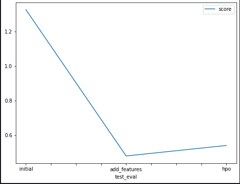
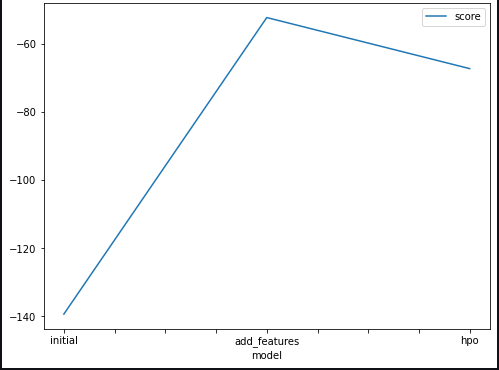

# Report: Predict Bike Sharing Demand with AutoGluon Solution
#### NAME HERE Tyrel Cadogan 

## Initial Training
### What did you realize when you tried to submit your predictions? What changes were needed to the output of the predictor to submit your results?
TODO: Add your explanation

The testing set did not have two features in it so the the predictor threw an error. Also all the negative values need to be set to zero since the target of the model is the number of rentals can only be a positive number.

### What was the top ranked model that performed?
TODO: Add your explanation
Weighted Emsemble L3

## Exploratory data analysis and feature creation
### What did the exploratory analysis find and how did you add additional features?
TODO: Add your explanation

I parsed the month and day from the date since its a possibility that some days and some moths may have more total rentals than some.
I also i parse the hour also since ther may be some relationship between the time of the day and the number of rentals in that da.

### How much better did your model preform after adding additional features and why do you think that is?
TODO: Add your explanation

Adding the month did not improve the model performance each month only occurs twice in the dataset since the dataset spans 2 years which is not statisticaly significant and hence did not improve the performace of the model. The day however contains roughly 104 different days which may have elucidated some patterns that relate the day to the number of rentals.

## Hyper parameter tuning
### How much better did your model preform after trying different hyper parameters?
TODO: Add your explanation

I didn't the model perfomance actually decares when the parameters were changed  

### If you were given more time with this dataset, where do you think you would spend more time?
TODO: Add your explanation

I would try specific models instead of autogluon. Also i would also try some PCA to remove redundancy in the data. 

### Create a table with the models you ran, the hyperparameters modified, and the kaggle score.
|model|hpo1|hpo2|hpo3|score|
|--|--|--|--|--|
|initial|Preset|Time limit|-|1.32|
|add_features|Number Of features|presets|time limit|0.47|
|hpo|Learning rate (NN Based Model)| Drop Out (NN based model)|number of leaves (Tree based Model)|0.54|

### Create a line plot showing the top model score for the three (or more) training runs during the project.

TODO: Replace the image below with your own.

### Create a line plot showing the top kaggle score for the three (or more) prediction submissions during the project.

TODO: Replace the image below with your own.

## Summary
TODO: Add your explanation
